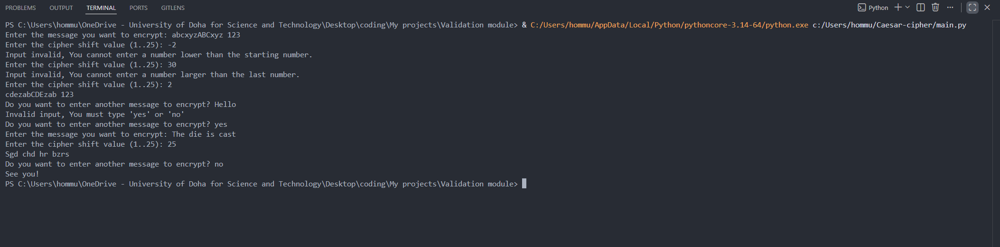

# Caesar Cipher in Python

A Python implementation of the classic Caesar Cipher encryption technique.

This project allows users to encrypt and decrypt text by shifting alphabetic characters by a chosen number of positions in the alphabet. It preserves letter case and leaves non-alphabetical characters unchanged.

## Features

- Encrypt plain text using a custom shift value
- Decrypt encrypted text back to its original form
- Supports both uppercase and lowercase letters
- Preserves spaces, numbers, and special characters
- Input validation for secure and reliable execution

## Purpose

The purpose of this project is to demonstrate the fundamentals of classical cryptography while strengthening Python programming skills.

It also highlights important concepts such as string manipulation, ASCII handling, modular design, and validation logic.

## Screenshot

*Example output of the Caesar Cipher project in action.*

## Technologies Used

- Python 3
- String Processing
- ASCII Encoding
- Modular Programming

## Author

Amr Deyab# Caesar-cipher
